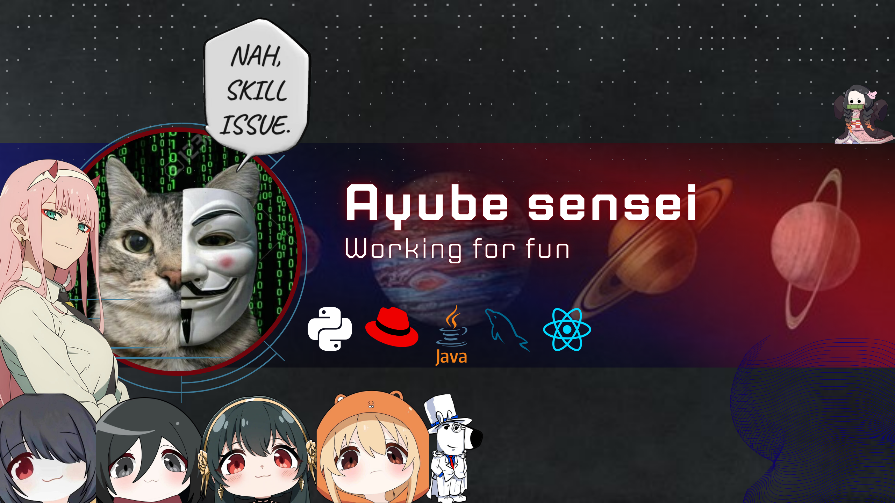

#### My Friends

       

#### Vibe Coding is great

   

<h4 data-importer="text" align="left">If you Want To folow me</h4>

###

  <!-- LINKEDIN -->
  
  
  <!-- DISCORD (Gunakan link server atau link chat direct Anda) -->
  
  
  <!-- INSTAGRAM -->
  

###

###

  

###

  

